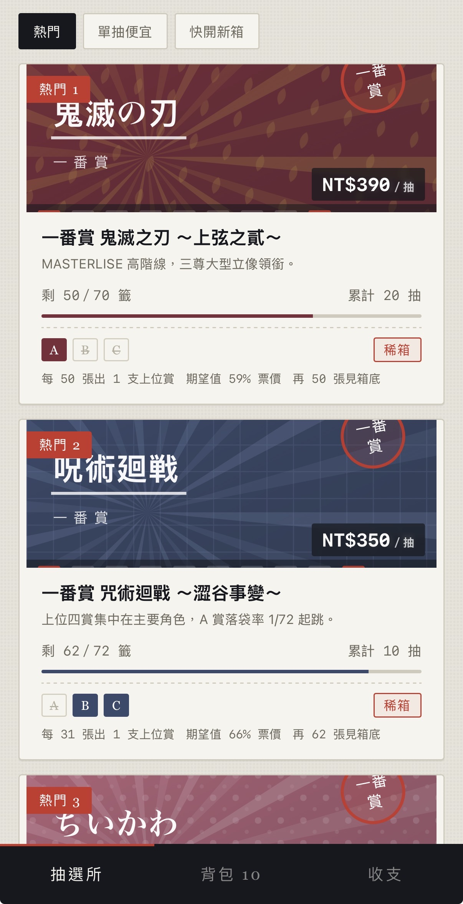
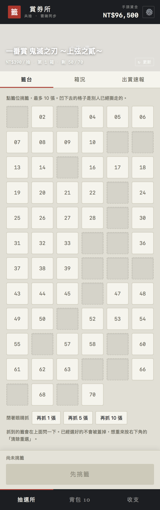
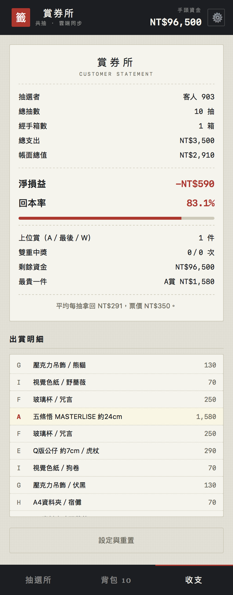

# 一番賞模擬器

一個讓人免費體驗「把錢砸在一番賞上是什麼感覺」的網頁。機率完全照實體箱的規則跑，
所有人共用同一箱，抽完自動換下一箱。

**線上試玩：** 
`https://ichiban-kuji-sim.netlify.app`

<!-- 建議放三張截圖：貨架、籤台、收支結算 -->




---

## 為什麼做這個

一番賞的討論常常停在「我抽到 A 賞了」或「我又摃龜」。真正決定體驗的是兩件事：
箱子裡的籤會越抽越少，以及大賞的市價往往低於抽到它的平均成本。這兩件事都不容易
靠零星的心得文感受到，但只要讓人連續撕三十張籤、最後看一張收據，就會很具體。

所以這個網頁不做保底、不做爆率加成、不美化價格。每人一開始有十萬元虛擬資金，
花完就是花完。

## 玩法

挑一檔，在籤台上點你要的號碼，最多十張，然後一張一張撕開。
撕到箱底那張的人拿走最後賞，系統接著開下一箱。

## 機制

### 籤序在洗箱時就定死

多數抽獎程式是「按下按鈕才擲骰子」。這裡不是。每開一箱，程式把所有賞別與款式攤平，
用 `crypto.getRandomValues` 做 Fisher–Yates 洗牌，把結果存成一串字元：

```
"AEFGHDFHGE…"   ← 第 n 個字元就是第 n 號籤的賞別
"0a3172b04c…"   ← 對應的款式編號（36 進位）
```

抽走的格子改寫成 `_`。你點 37 號，拿到的就是第 37 個字元代表的東西，不會在點下去的
瞬間才決定。這樣才對得上實體箱的行為，也才可能讓多人共用同一箱。

亂數用 `crypto.getRandomValues` 搭配拒絕採樣，避免直接取模造成的偏差。

### 共用箱況的衝突處理

所有人共用一份箱況，存在 Netlify Blobs。同步是七秒輪詢，不是即時推播，兩個人同時
抽必然會遇到覆寫問題。

處理方式是讓合併操作滿足交換律。同一箱號之下，兩份狀態合併時取「已抽走」的聯集：

```js
merged[i] = (a[i] === "_" || b[i] === "_") ? "_" : a[i];
```

籤只會從有變成沒有，不會反過來，所以誰先寫誰後寫都得到同樣結果。箱號不同時取較新
的那一箱。熱度統計同理，取兩邊的較大值。

這個作法擋得住絕大多數的併發，但它不是交易，人數多到同一秒有數十筆寫入時仍可能掉
更新。要撐那個規模得把箱況拆成一格一筆存進資料庫，用一句 SQL 做原子性的標記。
前端邏輯不用動，只要換掉 `readHall` 與 `writeHall`。

### 熱門度會衰退

排行用的是大家實際抽的次數，但單純累加會讓上個月紅過的一直卡在第一。所以熱度以
三天為半衰期遞減：

```js
heat = draws × 0.5 ^ (elapsed / 3days)
```

累計抽數本身照實顯示，衰退只影響排序。冷啟動時所有人都是零，這時退回一組內建名次
當起始排列。

### 賞品圖是程式畫的

官方商品照與主視覺都有版權，不能用。所以圖全部是即時產生的 SVG：賞品依品類
（立像、絨毛、玻璃杯、毛巾、吊飾、色紙…）畫幾何圖形，封面台紙依一番賞店頭台紙的
構圖重畫一版，九種底紋輪流搭配不同主副色，十一檔的組合不重複。

想換成自有授權的圖，資料裡每個賞項有 `img` 欄位、每一檔有 `cover` 欄位，填網址即可
取代，不必動程式。

### 音效沒有音檔

撕紙、蓋章、鈴、太鼓全部用 Web Audio API 即時合成。撕紙是白噪音過帶通濾波器做頻率
掃描，鈴是三個泛音疊加的指數衰減。這樣不必處理音檔授權，也不用額外請求。

## 技術

單一 HTML 檔，React 18 從 CDN 載入，JSX 在瀏覽器端用 Babel Standalone 即時編譯。
沒有建置步驟，`index.html` 雙擊就能跑。

後端只有一支 Netlify Function，用 Netlify Blobs 讀寫一份 JSON。相依套件已用 esbuild
打包進函式檔，所以拖曳部署也不需要安裝流程。

個人資料（資金、背包、抽選紀錄）存在瀏覽器本機，不上傳。共抽模式下只有暱稱與上位賞
紀錄會給其他人看到。

```
index.html                    整個前端
netlify/functions/hall.mjs    共用箱況的讀寫
src/ichiban-kuji-sim.jsx      React 原始碼（index.html 由此產生）
```

## 本機執行

```bash
# 最簡單：直接開檔案，共抽會自動退回本機模式
open index.html

# 想連後端一起測
npx netlify-cli dev
```

## 部署

**拖曳**：把整個資料夾壓成 zip 丟進 Netlify 的部署區。

**接 Git**：Netlify → Add new site → Import an existing project，選這個 repo。
`netlify.toml` 已設好發布目錄與函式目錄，不需要建置指令。之後 push 就自動更新。

## 免責聲明

本專案是個人練習作品，與 BANDAI SPIRITS 及任何權利人無關，未取得亦未主張任何授權。

站內出現的作品名稱、角色名稱與商品名稱屬各自權利人所有，僅作為模擬對象的識別用途。
賞項組成與配率是依公開情報與通路揭露資訊還原的，非官方資料，可能與實際商品有出入。
價格為市場行情概估，不構成任何交易建議。

所有圖像均為本專案自製的向量圖形，未使用任何官方素材。

站內沒有真實金錢往來，也沒有任何可兌換的實體或虛擬物品。這是一個模擬器，不是抽獎
服務，也不是購買管道。

## 授權

程式碼與自製圖版採 MIT 授權，見 [LICENSE](LICENSE)。
